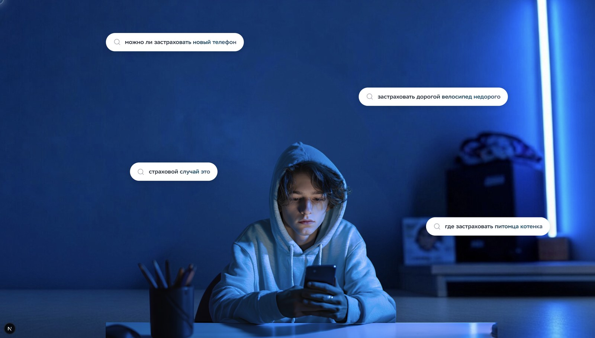
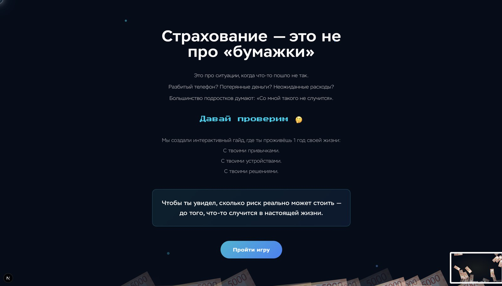
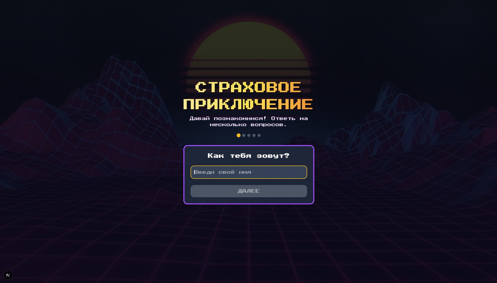
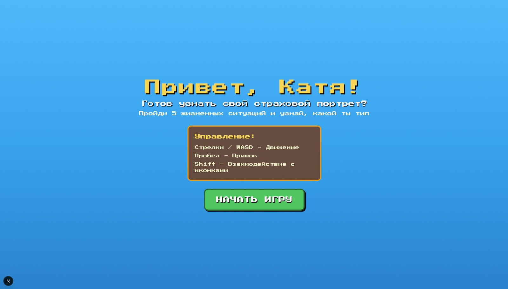
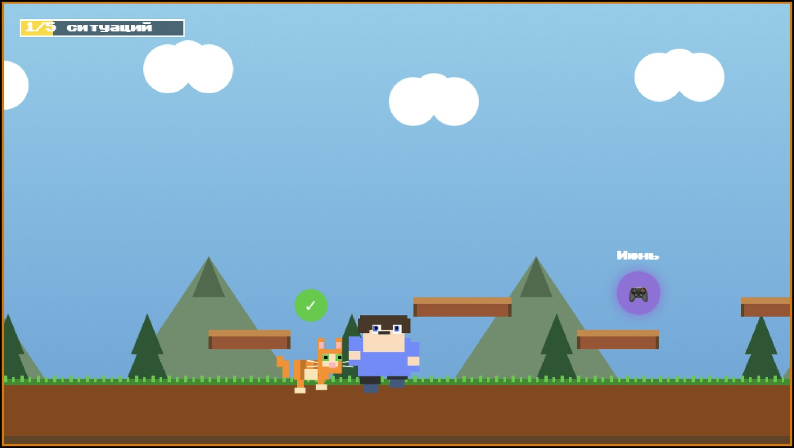
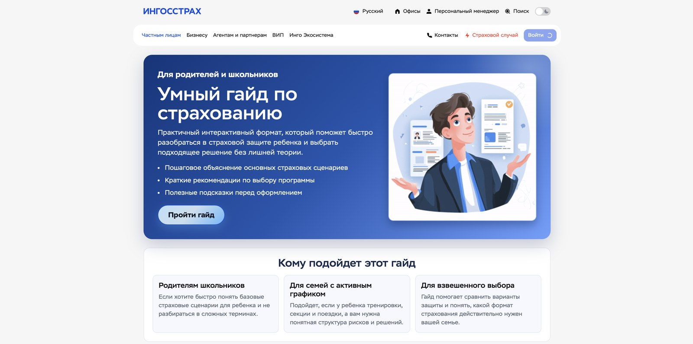
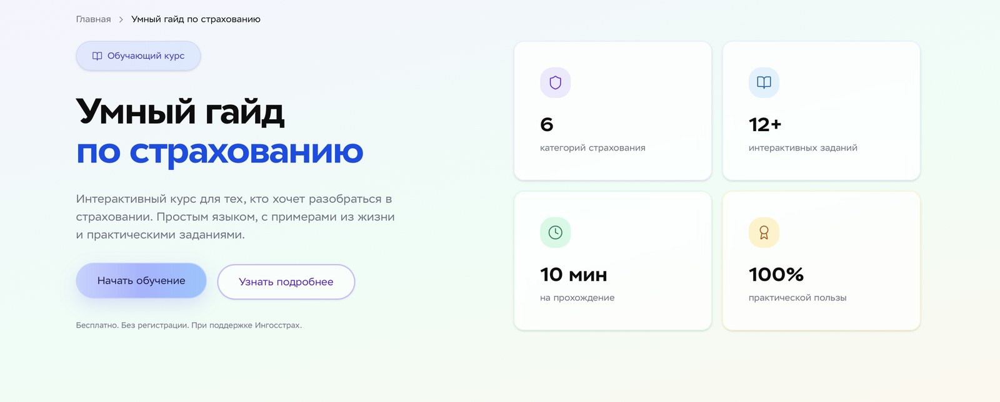
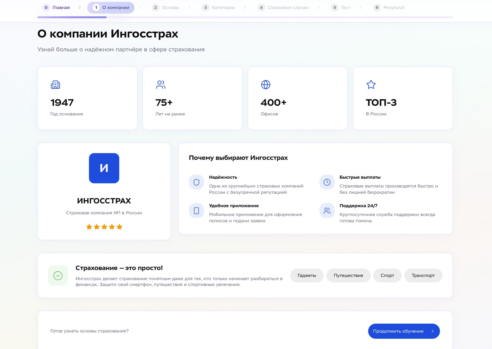

<div align="center">

# IGS Guide

**Интерактивный гайд по страхованию для подростков**

Не лекция из учебника, а визуальный опыт: от живого лендинга до пиксельной «симуляции года жизни», где решения и привычки складываются в понятную картину риска и последствий




<sub>Hero-экран лендинга: параллакс и всплывающие «пузыри» с реальными поисковыми запросами подростков</sub>

</div>

---

## Зачем этот проект

Многие подростки воспринимают страхование как «про бумажки» и чужие истории. Гайд говорит на языке, близком аудитории: короткие экраны, motion-анимации, прямое обращение «ты», переход к игре — без морализаторства, с фокусом на **эмоции и личный выбор**, из которых потом складывается осознанность.

---

## Демо

### 1. Лендинг — `main_screen`

После hero-экрана пользователь проходит через переходный блок с эффектом «дождя» из купюр и попадает на экран мотивации, откуда ведёт кнопка в игру.

<table>
  <tr>
    <td width="50%"></td>
    <td width="50%"></td>
  </tr>
  <tr>
    <td align="center"><sub>Переход с эффектом «дождя» (Framer Motion)</sub></td>
    <td align="center"><sub>Экран мотивации и вход в игру</sub></td>
  </tr>
</table>

### 2. Пиксельная игра — `pixel_game`

Короткий онбординг, затем платформер: персонаж проживает год, а на пути ему встречаются жизненные ситуации, связанные с риском. По итогам 5 ситуаций игрок узнаёт свой «страховой портрет».

<table>
  <tr>
    <td width="50%"></td>
    <td width="50%"></td>
  </tr>
  <tr>
    <td align="center"><sub>Онбординг: знакомство с игроком</sub></td>
    <td align="center"><sub>Персональное приветствие и управление</sub></td>
  </tr>
</table>



<p align="center"><sub>Игровой процесс: месяцы года, иконки ситуаций (Shift — взаимодействие) и прогресс «1/5 ситуаций»</sub></p>

### 3. Гайд — `guide`

Пошаговый курс для родителей и школьников: вход со страницы в стиле сайта страховой компании, затем 6 шагов с прогресс-баром — «О компании», «Основы», «Категории», «Страховые случаи», «Тест», «Результат».

<table>
  <tr>
    <td width="50%"></td>
    <td width="50%"></td>
  </tr>
  <tr>
    <td align="center"><sub>Точка входа: баннер «Пройти гайд»</sub></td>
    <td align="center"><sub>Стартовый экран курса</sub></td>
  </tr>
</table>



<p align="center"><sub>Шаг курса с навигацией и прогрессом прохождения</sub></p>

---

## Что внутри

| Часть | Описание |
|--------|----------|
| **`main_screen/`** | Лендинг на Next.js: hero с параллаксом и поисковым «пузырём», блок перехода с эффектом «дождя», экран мотивации и кнопка входа в игру. Кастомный курсор, Framer Motion, единая палитра фонов между секциями. |
| **`pixel_game/`** | Отдельное Next-приложение — пиксельная игра/симуляция (компонент `Game`), на которую ведёт лендинг. |
| **`guide/`** | Next-приложение с пошаговым гайдом: 6 шагов от знакомства с компанией до теста и результата. |

Связка лендинг → игра задаётся переменной окружения `NEXT_PUBLIC_PIXEL_GAME_URL` (по умолчанию переход на `/pixel_game` при общем хосте или на отдельный URL деплоя игры).

---

## Стек

- **Next.js** 16 · **React** 19 · **TypeScript**
- **Tailwind CSS** 4
- **Framer Motion** — анимации и скролл-триггеры
- **Radix UI** / shadcn-паттерны — переиспользуемые UI-компоненты в `main_screen/components/ui`

---

## Быстрый старт

### Лендинг (`main_screen`)

```bash
cd main_screen
npm install
npm run dev
```

Открой [http://localhost:3000](http://localhost:3000). Для разработки используй `npm run dev`; `npm start` — только после `npm run build` (production).

### Пиксельная игра (`pixel_game`)

```bash
cd pixel_game
npm install
npm run dev
```

Укажи порт при необходимости (например, `3001`), и пропиши в `main_screen/.env.local`:

```env
NEXT_PUBLIC_PIXEL_GAME_URL=http://localhost:3001
```

### Переменные окружения

| Переменная | Назначение |
|------------|------------|
| `NEXT_PUBLIC_PIXEL_GAME_URL` | Полный URL приложения игры при раздельном деплое или другом порте |

---

## Скрипты

В каждой папке с `package.json`:

| Команда | Действие |
|---------|----------|
| `npm run dev` | Режим разработки |
| `npm run build` | Production-сборка |
| `npm run start` | Запуск собранного приложения |
| `npm run lint` | ESLint |

---

## Структура репозитория (кратко)

```
Igs_guide/
├── main_screen/          # Лендинг (основная точка входа)
├── pixel_game/           # Игра / симуляция
├── guide/                # Пошаговый гайд
├── docs/screenshots/     # Скриншоты для README
└── README.md
```

---

## Идеи для развития

- Единый деплой (монорепо) или прокси с одного домена на лендинг и игру
- Аналитика событий (клик «Погнали», старт игры)
- A/B тексты под разные возрастные когорты
- Accessibility: режим без кастомного курсора, контраст, `prefers-reduced-motion`

---

*Сделано как образовательный опыт: страхование через историю и действие пользователя, а не через список терминов.*

**Автор:** [katshuuu](https://github.com/katshuuu)
